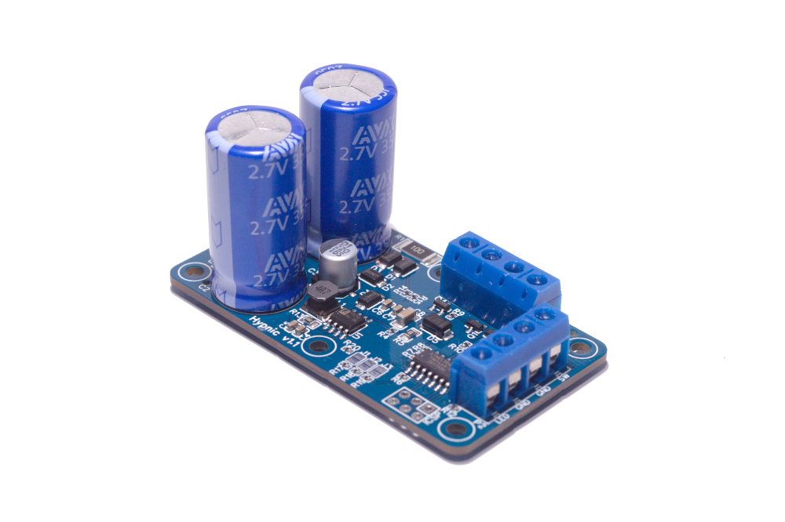

# FALK Hypnic Power Manager
## Power management board for single board computers

Prototype board

### Introduction
While building the [DP-01](../dp-01/README.md) based on the Raspberry Pi I wanted to turn the Raspberry Pi into an audio "appliance". The problem is that, like most Single Board Computers (SBCs), the Raspberry Pi doesn't support a power button and once it's powered off, the only way to power it back on is to remove it's power source and add it again. On top of that, you can't simply remove power from it in fear of corrupting the SD card, so I needed a way to gracefully power down when power is removed. I also wanted to the flexibility to be able to use any SBC later, not tying the board to a specific SBC (like the Raspberry Pi) and I couldn't find a solution to this off the shelf that perfectly fit my needs, so I built one.

The Hypnic board is designed to provide just enough power for a SBC to power down gracefully when power is lost. It's not device specific (it's not a Raspberry Pi HAT) and as such supports many SBCs, not just the Raspberry Pi.

### Features
* 5V@3A output to the SBC
* Switch power on/off to SBC
* Provide power switch for SBC
* Provide power status with LED
* Remove battery maintenance (use supercapacitors)
* Provide enough energy to allow the SBC to power down gracefully
* Optionally, power on SBC when external power is turned on
* Optionally, power on SBC only where there's enough charge

### Requirements
A regulated power supply that matches the power requirement for your SBC, preferably with some overhead. The board itself can provide 3A of power, it's recommended to have a little more than the SBC drains to allow enough power for the supercapacitors to fully charge without affecting power to the SBC. There's a stackable 5V 5A power supply available, although you can use any 5V regulated power supply

### Hardware
If you're interested, these are the main devices on the board:
* ATTiny 44 microcontroller (provides logic)
* A pair of medium sized supercapacitors for power reserve
* A 5V boost module (to guarantee 5V output to the SBC)
* Some discreet components
