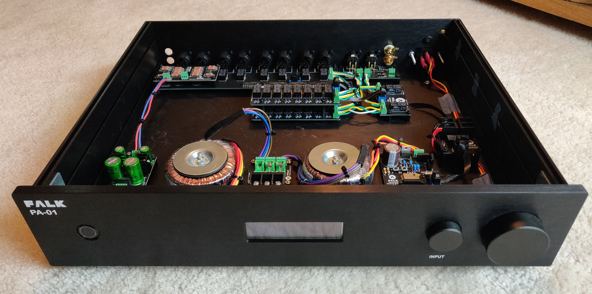

# FALK PA-01
## Passive Modular Preamplifier

### Introduction
The PA-01 Modular Preamplifier is a set of designs created to allow DIY audio enthusiasts a way to build a preamplifier that suits their individual needs by picking from a set of predefined components and putting them together to create a complete system.

Generally, a system is made from a minimum of four basic components:
* Input board (balanced or single ended)
* Volume board
* Output board (balanced or single ended)
* Control board

Other optional boards can be used, including daughter boards for single-ended to balanced or balanced to single-ended conversion and display / button boards. Optionally, third party boards can be included, for example audio buffers or phono stages.

At this time, the boards are available as design-ware, including schematics, PCB designs, BOM (bills of material) and Gerber files for PCB production. Any software required (firmware for microcontrollers) is also available.

To build your own system, select the boards that you need to build your system, have them produced at a PCB manufacturer of your choice, order the parts needed and finally assemble the boards and install them into an enclosure of your choice.

Throughout the design, care has been taken to isolate the control and audio paths. Relays are switched using pulses of 5V DC power, so power is not continuously provided to the audio boards. Additionally, the boards are designed to physically separate control and audio wherever possible.

### Features
* Modular design for flexible builds
* Compact, stackable boards (where possible)
* Separation of audio and control paths
* Latching relays for input and volume attenuator boards
* Options for balanced and unbalanced inputs/outputs
* WiFi-enabled with web-based UI
* Configurable inputs (names, icons, enable/disable)
* Linear power supplies throughout
* Volume limit
* Startup Volume Limit
* Fully extensible; build your own custom boards and share them
* Completely open source

### Skills required
In order to build one of these systems, you’ll need to know how to order PCBs (although it’s not difficult) from a manufacturer. There are many who cater to enthusiasts. You’ll need to be handy with a soldering iron (especially for the advanced control board). You need to know how to read and operate a multimeter as a minimum and for some components you need to be confident working with mains voltage. You’ll also need to be at least vaguely comfortable flashing microcontrollers, although this document will talk you through the process.

This set of designs was created to be as approachable as possible. Only one component is surface-mount, the ESP32 (because it doesn’t come any other way) and it’s large enough that you can solder it with an iron. Unless you’re modifying things, you don’t need to know how to write code, debug or anything of the sort.

Last of all, you need to be able to enjoy audio equipment!

### Boards

There are a number of boards to choose from and new boards on the way. The following is a summary of currently available and planned boards.

#### Input
* Balanced (3+1) XLR input board
** Single-Ended to Balanced Daughter-board
* Single ended (6) input board

#### Volume
* Stackable Volume Board (relay attenuator)

#### Output
Balanced Output Board (XLR + RCA)

#### Control
* [Advanced Control Board](boards/control/advanced-control-board/)
* Screen board (OLED)
* Button board (Rotary encoders)
* Simple Control Board (WIP)
