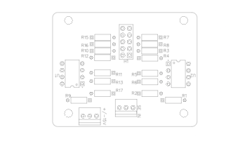
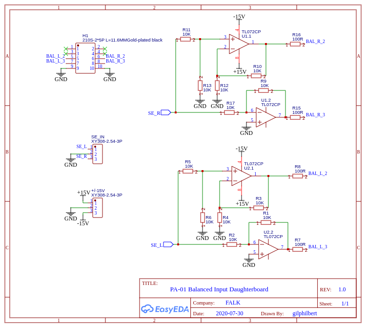

# Balanced Input Daughterboard (FALK PA-01)

The Balanced Input Daughterboard is designed to clip onto the Balanced Input Board and converts a Single-Ended input to be converted to a Balanced Input for the system. It's designed to clip directly over Input 4 and provides a 3-pin header for a SE input connection. The board requires a 15V dual-rail power supply and leverages identical opamp circuits to handle the conversion. Audio-grade resistors are recommended for this board as, like on the Volume Relay Board, they sit directly in the audio path.

## Using the board
Simply plug the board into the Balanced Input Board, wire the pair of SE connections to the Left (L), Ground (G, joining the ground wires of the two connections together) and Right (R) headers on the board. Connect a dual-rail 15V power supply and enjoy.

## Building the board
You can find the full Bill Of Materials below, this board is very simple, just solder each component in place and plug into the main board chain using a chained IDC cable.

### Schematic

## PCB Layout

## Bill Of Materials
Use the BOM in this directory for components.

**NOTE:**
While it is possible to substitute the resistors above for other components, it is *strongly* recommended to use the above components as these will offer the best sonic quality. Always use matching, 1% tolerance, high quality resistors. Vishay Dale RN or CMF are the recommended types.
