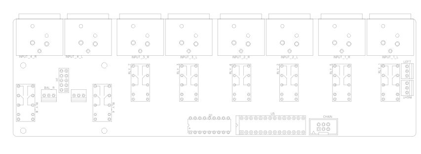
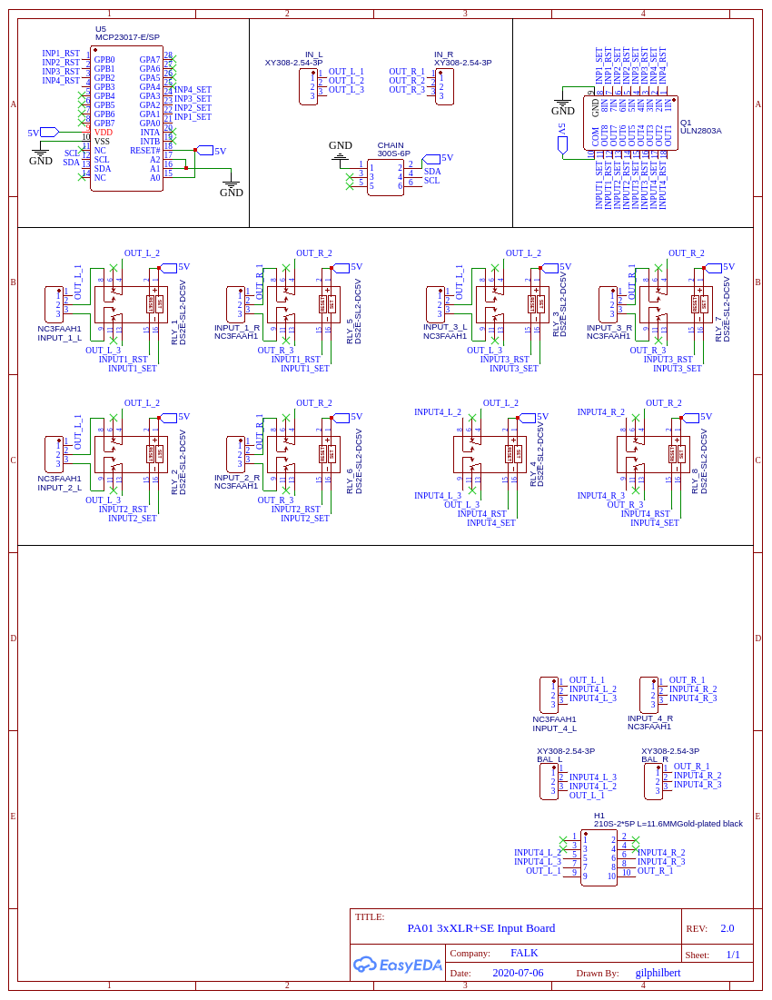

# Balanced Input Board (FALK PA-01)

The Balanced Input Board provides a relay-based fully balanced input selection unit. Like the Stackable Volume Board, it utilizes latching relays to prevent DC current flowing through the board during normal operation. Physical separation of the power and audio paths is maintained throughout the board design. The board is i2c controlled like the volume control boards.

The board is connected to a control board using the same 6-pin IDC connector as on other boards. The balanced input board can be populated with up to four inputs, one of which supports a SE to balanced daughter-board to allow the connection of a SE input, sacraficing one balanced input.

The board is audio-transparent as it puts a single relay contact in the path of each input and nothing more.

## Building the board
You can find the full Bill Of Materials included in this directory, this board is very simple, just solder each component in place and plug into the main board chain using a chained IDC cable.

### Schematic

## PCB Layout

