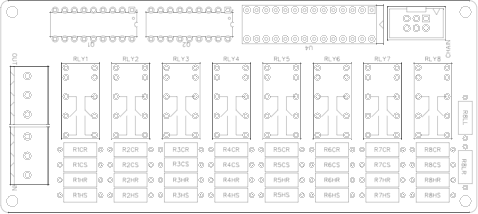
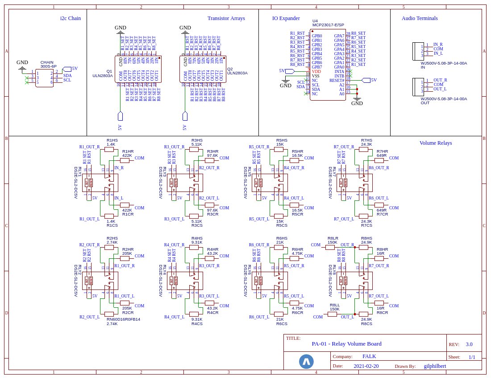
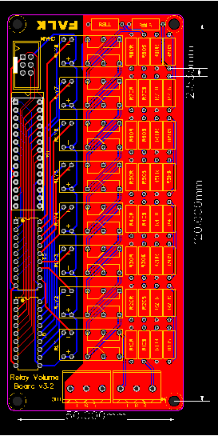

# Advanced Control Board (FALK PA-01)

The Volume Relay Board provides a relay-based resistor attenuator for controlling volume. It supports 255 0.5db volume increments from -128db to 0 (mute). Like the input boards, the Stackable Volume Board utilizes latching relays to prevent DC current flowing through the board during normal operation. Physical separation of the power and audio paths is maintained throughout the board design. The board uses 1% tolerance, audio-quality resistors to ensure matching volume across channels across all volume levels.

The board is connected to a control board using the same 6-pin IDC connector as on other boards. This volume board offers excellent flexibility, and can be used for both single-ended and balanced configurations. While boards can be stacked, they can also be installed side-by-side for low-profile installations where height is an issue.

The board implements a relay ladder attenuator (I won't go into theory here, you can read up the theory on Wikipedia) that provides a logarithmic output. It is configured to provide input and output impedence that should work with any upstream and downstream components, removing the need for any active stages in the preamplifier.

### Single-Ended Configuration
For a single-ended system one volume board is required. The board will switch both the left and right channels through each relay and matching resistors. Simply connect the Volume Relay Board to the Control Board, connect the left, right and ground connections as marked from the incoming source (input board, buffer, etc.) to the matching pins on three-pin header IN. The pins on the three-pin header OUT should then be connected to the next board in the chain (output board, buffer, etc.).

### Balanced Configuration
For balanced systems, a pair of boards can be used, one to switch the hot and cold lines for each channel. The control board is capable of supplying enough current to switch both volume boards in parallel. Simply add a connector for the chain to each volume control board. Both boards carry the same i2c address and will both switch as the volume is changed. Connect the hot and cold (+/-) lines for each balanced channel to the L and R channels - making sure you keep these consistent so you don't mix them - and connect the ground channel to "G".

## Building the board
You can find the full Bill Of Materials below, this board is very simple, just solder each component in place and plug into the main board chain using a chained IDC cable.

### Schematic

## PCB Layout

## Bill Of Materials
| Part | Quantity | Symbol | Manufacturer | Distributor |
|-|-|-|-|-|
| G6A-274P-ST-US-DC5 | 8 | RLY1,RLY2,RLY3,RLY4,RLY5,RLY6,RLY7,RLY8 | OMRON | DigiKey, Mouser |
| ULN2803A | 2 | Q1, Q2 | STMicroelectronics | DigiKey, Mouser |
| MCP23017-E/SP | 1 | U4 | STMicroelectronics | DigiKey, Mouser |
| 75869-131LF | 1 | CHAIN | Amphenol FCI | DigiKey, Mouser |
| 282851-3 | 2 | IN, OUT | TE Connectivity | DigiKey, Mouser |
| RN60D1503FRE6 | 2 | LL, LR | Vishay / Dale | DigiKey, Mouser |
| RN60D4223FB14 | 2 | R1: HR, CR | Vishay / Dale | DigiKey, Mouser |
| RN60D1401FB14 | 2 | R1: HS, CS | Vishay / Dale | DigiKey, Mouser |
| RN60D2053FB14 | 2 | R2: HR, CR | Vishay / Dale | DigiKey, Mouser |
| RN60D2741FRE6 | 2 | R2: HS, CS | Vishay / Dale | DigiKey, Mouser |
| RN60D9762FB14 | 2 | R3: HR, CR | Vishay / Dale | DigiKey, Mouser |
| RN60D5111FRE6 | 2 | R3: HS, CS | Vishay / Dale | DigiKey, Mouser |
| RN60D4322FB14 | 2 | R4: HR, CR | Vishay / Dale | DigiKey, Mouser |
| RN60D9311FB14 | 2 | R4: HS, CS | Vishay / Dale | DigiKey, Mouser |
| RN60D1652FB14 | 2 | R5: HR, CR | Vishay / Dale | DigiKey, Mouser |
| RN60D1502FRE6 | 2 | R5: HS, CS | Vishay / Dale | DigiKey, Mouser |
| RN60D4751FRE6 | 2 | R6: HR, CR | Vishay / Dale | DigiKey, Mouser |
| RN60D2102FB14 | 2 | R6: HS, CS | Vishay / Dale | DigiKey, Mouser |
| RN60D6490FB14 | 2 | R7: HR, CR | Vishay / Dale | DigiKey, Mouser |
| RN60C2432FB14 | 2 | R7: HS, CS | Vishay / Dale | DigiKey, Mouser |
| RN60D16R0FB14 | 2 | R8: HR, CR | Vishay / Dale | DigiKey, Mouser |
| RN60D2492FB14 | 2 | R8: HS, CS | Vishay / Dale | DigiKey, Mouser |

*NOTE*
While it is possible to substitute the resistors above for other components, it is *strongly* recommended to use the above components as these will offer the best sonic quality. Always use matching, 1% tolerance, high quality resistors. Vishay Dale RN or CMF are the recommended types.