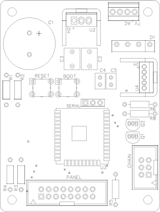

# Advanced Control Board (FALK PA-01)

The Advanced Control Board is arguably the most complex board in the build, but it is also the most powerful. It’s powered by the ESP32-WROOM-32 module from Espressif Systems - a very fast, very capable microcontroller that includes Wifi, Bluetooth and many advanced features not even used in this board. For our purposes, it controls the input and volume boards, draws the content from the screen, reads the controls and even runs a web server so you can interact with the control board using a web browser.

Features of this control board are:
* Powers all boards (except the input/output daughterboards)
* Provides the microcontroller controls the preamplifier
* Reads input from the buttons/encoders and selects the correct inputs/volume
* Features a built-in power supply, although this can be omitted in preference of another 5V power supply of your choice
* Ability to program the names of the inputs
* Set a maximum volume, for safety
* Set a maximum startup volume
* Firmware can be updated from the web interface; access to the board is not required after the initial programming
* Can be controlled using the built-in controls, supports Bluetooth remote controls and can also be controlled via the web interface

### Power Supplies
It’s recommended to use the built-in power supply. It’s a simple, low-cost power supply design that provides the correct amount of current for the system. It requires only an external transformer and since the control and audio paths are kept separate, the power supply doesn’t affect audio quality. Any transformer can be used, and lower cost alternatives are available, but the one in the BOM is available worldwide and can be configured for both 115/120/230/240 volt environments. The power supply design is the same for 50hz and 60hz power supplies. If you are selecting your own transformer, simply ensure the transformer is providing between 7 and 12V AC before connecting it to the board.

It is also possible to use a DC power supply of your choice if you wish. This could be because you happen to have one you like, you’re not comfortable working with mains power or you’re a fanatic about power supplies in audio (which is perfectly acceptable!). To use your own power supply, omit the transformer, D1, D2, C1, C2, U1 and the heatsink H2. The remaining capacitors C4 and C5 and the regulator U2 and it’s heatsink H2 are mandatory as they provide 3.3V to the microcontroller and other devices. Connect a regulated 5V power supply to the pins marked on the footprint of U1.

### Building the board
The Advanced Control Board is the most complex board in the series. The actual build is not overly complex, but it’s best to test as you build. If you’re using the built-in power supply, start by populating the components used in that circuit first (the screw terminal, D1. D2, C1, C2, C3 and U1. Power on the board and use a multimeter to check you’re getting 5V from the regulator, U1. Remove the power and add C4, C5 and U2. Restore power and check you’re getting 3.3V from the regulator U2. Make sure you add the heatsinks to U1 and U2. Now continue populating the remaining components. The ESP32 is usually the next to add (you want to add it before you add too many more components). Use either a fine-tipped soldering iron with fine solder, or solder paste and a hot-air gun to add the device. Populate the remaining components.

### Loading the board’s firmware
The microcontroller used in this board is the official ESP32-WROOM-32 chip, produced by EspressIf. It will come from the factory blank and must be flashed with the PA-01 firmware to function. This process needs only to be carried out once; any future firmware updated can be performed using the Web-based UI built into the Advanced Control Board.

You will need a USB UART programmer - one is included in the BOM for the Advanced Control Board. You don’t need a specific one, any will do so if you have one already, or an FTDI programmer you can use that. Connect the Ground, RX and TX as marked on the board to the same marked pins on the USB/UART board, then power on the board and connect the UART adapter to a USB port on your PC.

There are many ways to flash the firmware. If you’re customizing the firmware, you can get a copy from the GitHub repo (https://github.com/gilphilbert/falk-pa01-advanced) and customize then flash it.

If you’re just using the stock firmware (recommended for beginners!) then you can get a copy from the releases section:
https://github.com/gilphilbert/falk-pa01-advanced/releases
Download the latest firmware and extract the application.bin and firmware.bin files from the zip file.

Finally, you will need to flash the firmware to the Advanced Control Board. If you’re comfortable using esptool.py, go ahead and flash as usual. For most people this won’t be true, so this document shows how to flash using a simple GUI tool. esphome-flasher is probably the easiest tool, so head to the releases page and download the correct version for your computer. If you have a modern Windows 10 machine, then most likely you will want the Windows x64 version:
https://github.com/esphome/esphome-flasher/releases

When you open esphome-flasher in Windows you’ll get a warning that it’s not trusted. This is expected, simply click “Run Anyway” to continue. You should get the following screen:

Select the correct serial port (it’s likely you’ll only have one, if not, try them all until it works!). Click “Browse” and locate the application.bin file. This file contains the web-based UI and is required for operation. Click “Flash ESP” to load the firmware onto the Advanced Control Board. If you’re having problems flashing, make sure the board is powered on, the USB UART adapter is plugged into the board and the PC and that the pins on the adapter are wired correctly to the pins on the board. Try swapping the RX and TX pins if it’s not working. Once the flash is complete, the Advanced Control Board will reboot. However, one step is left, to flash the device firmware. Locate the firmware.bin file and click “Flash ESP” again. Once both files are flashed, you can disconnect everything - the board is now complete. If you have a display board ready, connect the display board using an IDC cable and power up the control board. You should see “Input 1” and “20%” shown on the screen.

For information getting started with using the Advanced Control Board, see the user manual:
