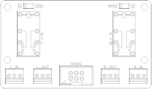
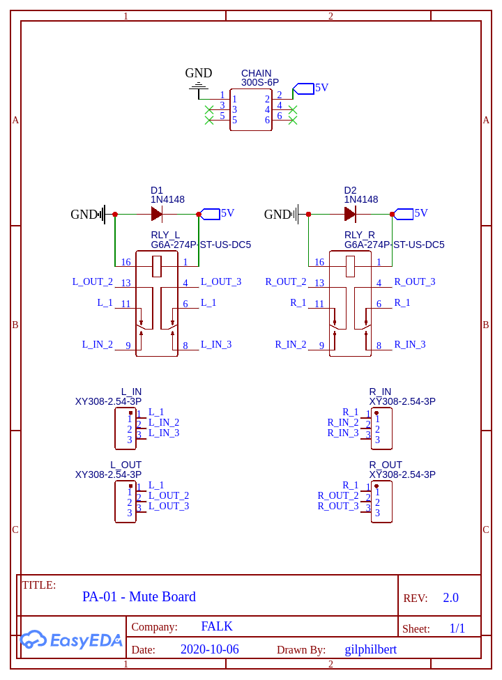
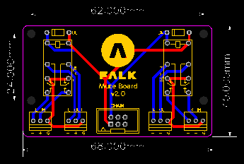

# Mute Board (FALK PA-01)

The PA-01 Mute Board is designed to mute the output of the passive amplifier when power is removed from the board. This allows the audio signal to be removed when either power is removed from the device or when the Control Board removes power from the 5V line by pulling the ENABLE pin low on the 5V regulator. Either of these actions will disable all external boards. As the input boards use latching relays, without this board powering off the amplifier wouldn't actually turn off the input, resulting in sound passed through the amplifier with no way to control volume until the preamplifier was powered back on.

## Building the board
You can find the full Bill Of Materials below, this board is very simple, just solder each component in place and plug into the main board chain using a chained IDC cable.

### Schematic

## PCB Layout

## Bill Of Materials
| Part | Quantity | Symbol | Manufacturer | Distributor |
|-|-|-|-|-|
| G6A-274P-ST-US-DC5 | 2 | RLY_L, RLY_R | OMRON | DigiKey, Mouser |
| 1N4148 | 2 | D1, D2 | ON Semiconductor | DigiKey, Mouser |
| 75869-131LF | 2 | CHAIN | Amphenol FCI | DigiKey, Mouser |
| 282834-3 | 4 | L_IN, L_OUT, R_IN, R_OUT | TE Connectivity | DigiKey, Mouser |